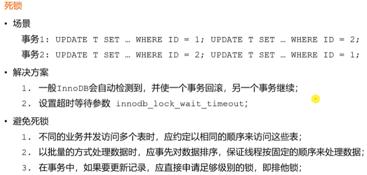
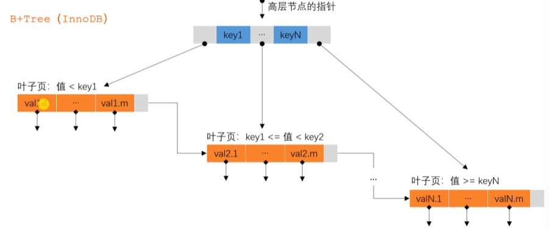
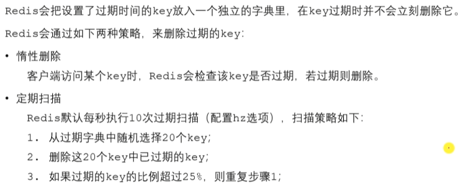
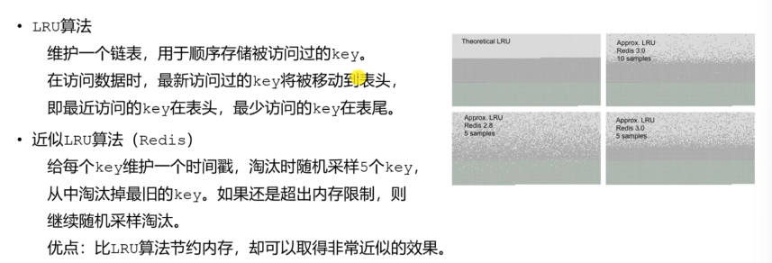
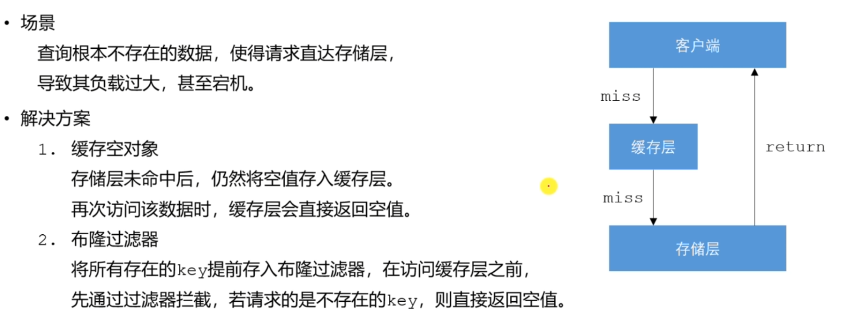
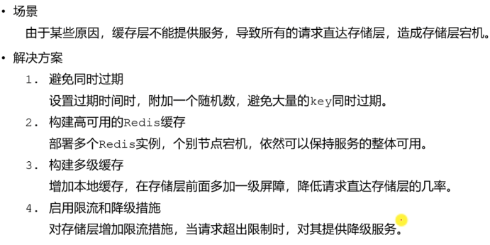
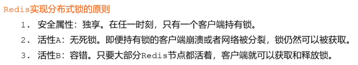
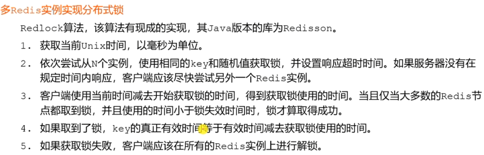
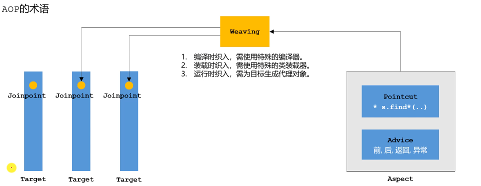
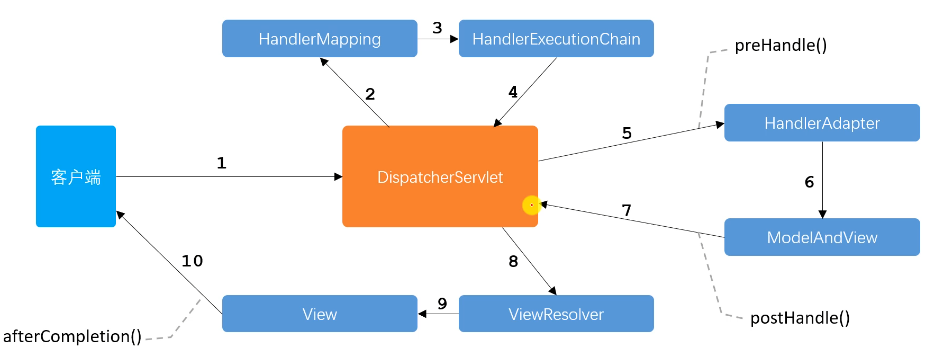

# NowCoderCommunity
NowCoder community
- 项目来源
  - https://www.nowcoder.com/courses/semester/senior
- 开发日志
  - 2022-04-06 社区首页
  - 2022-04-09 发送邮件功能
  - 2022-04-09 注册功能
  - 2022-04-13 验证码功能
  - 2022-04-16 登录退出功能
  - 2022-04-16 登录拦截器
  - 2022-04-17 账号设置功能
  - 2022-04-18 登录状态检查功能
  - 2022-08-13 发布帖子功能
  - 2022-08-14 评论功能
  - 2022-08-14 私信功能
  - 2022-08-15 统一异常处理，统一日志记录
  - 2022-08-16 点赞功能
  - 2022-08-16 关注功能
  - 2022-08-16 Redis优化登录模块
  - 2022-08-17 Kafka实现系统通知
  - 2022-08-18 搜索功能接口 (ElasticSearch版本问题后续有时间再完善实际功能)
  - 2022-08-18 SpringSecurity实现权限控制
  - 2022-08-19 置顶删除加精功能
  - 2022-08-19 网站数据统计
  - 2022-08-19 热贴排行
  - 2022-08-19 生成长图
  - 2022-08-20 Caffeine实现本地缓存
- 项目总结
  1. 核心功能：
     - 发帖、评论、私信、转发；
     - 点赞、关注、通知、搜索；
     - 权限、统计、调度、监控；
  2. 核心技术：
     - Spring Boot、SSM
     - Redis、Kafka、ElasticSearch
     - Spring Security、Quartz、Caffeine
  3. 项目亮点：
     - 项目构建在Spring Boot+SSM框架之上，并统一的进行了状态管理、事务管理、异常处理；
     - 利用Redis实现了点赞和关注功能；
     - 利用Kafka实现了异步的站内通知；
     - 利用ElasticSearch实现了全文搜索功能，可准确匹配搜索结果，并高亮显示关键词；
     - 利用Caffeine+Redis实现了两级缓存，并优化了热门帖子的访问。
     - 利用Spring Security实现了权限控制，实现了多重角色、URL级别的权限管理；
     - 利用HyperLogLog、Bitmap分别实现了UV、DAU的统计功能，100万用户数据只需*M内存空间；
     - 利用Quartz实现了任务调度功能，并实现了定时计算帖子分数、定时清理垃圾文件等功能；
     - 利用Actuator对应用的Bean、缓存、日志、路径等多个维度进行了监控，并通过自定义的端点对数据库连接进行了监控。
  4. 项目结构
       
       
  5. 常见面试题
     - Mysql
       - 存储引擎
       
       - 事务
       
       - 锁
       
       
       
       
       - 索引
       
       
     - Redis
       - 数据类型
       
       - 过期策略
       
       - 淘汰策略
       
       
       - 缓存穿透
       
       - 缓存击穿
       
       - 缓存雪崩
       
       - 分布式锁
       
       
       
       
     - Spring
       - IOC
       
       - AOP
       
       - MVC
       