### 相关知识
- Mysql
  - 存储引擎
  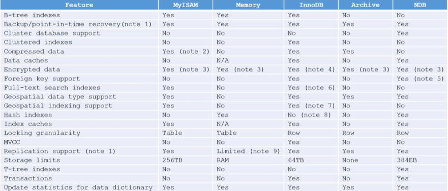
  - 事务
  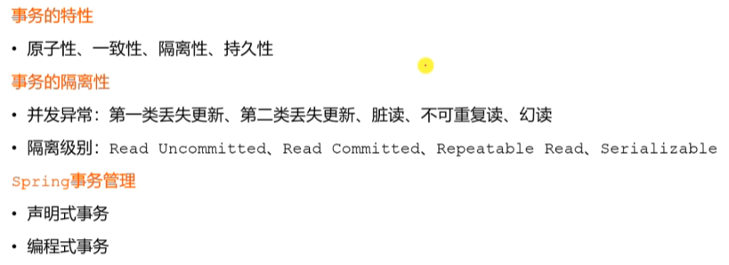
  - 锁
  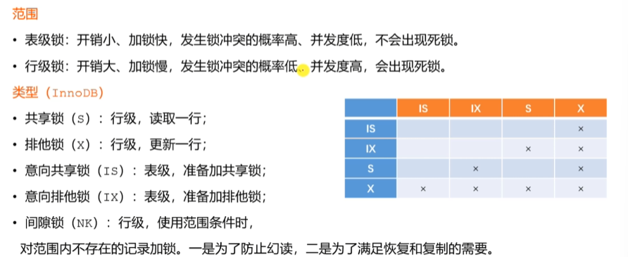
  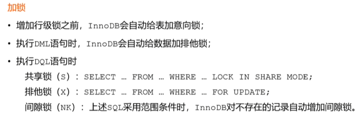
  
  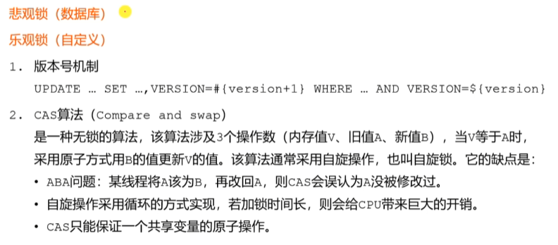
  - 索引
  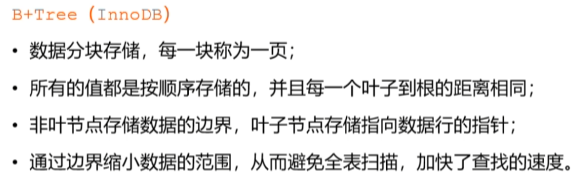
  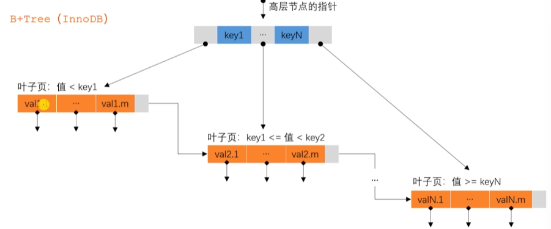
- Redis
  - 数据类型
  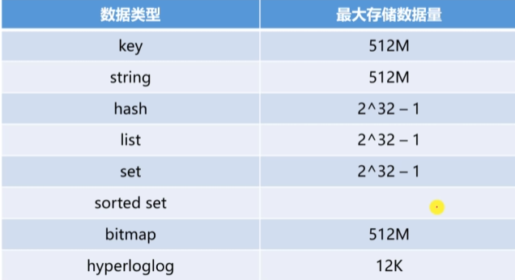
  - 过期策略
  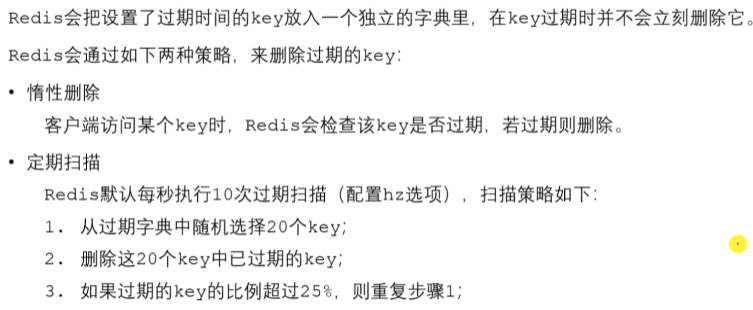
  - 淘汰策略
  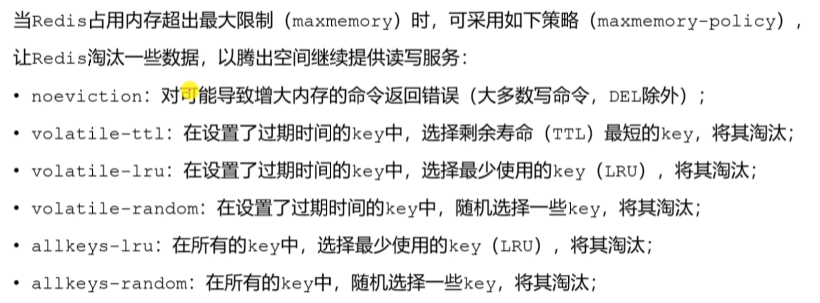
  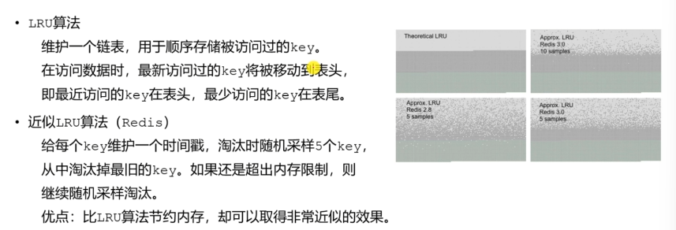
  - 缓存穿透
  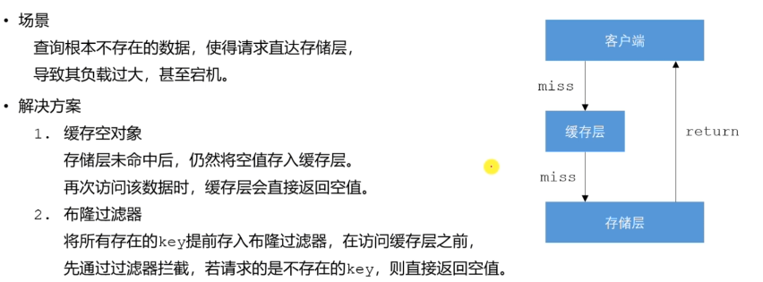
  - 缓存击穿
  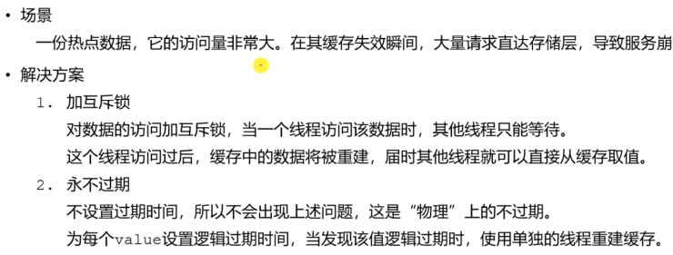
  - 缓存雪崩
  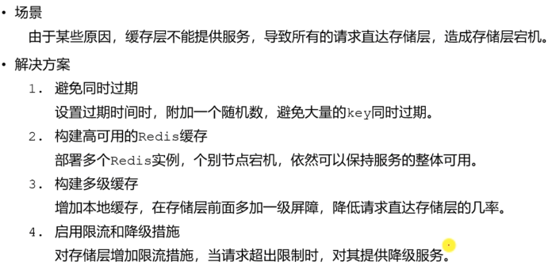
  - 分布式锁
  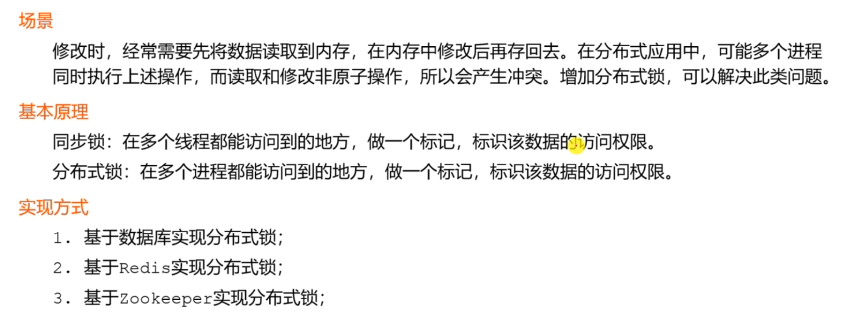
  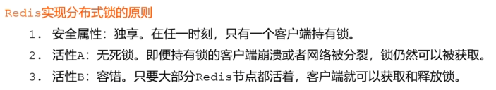
  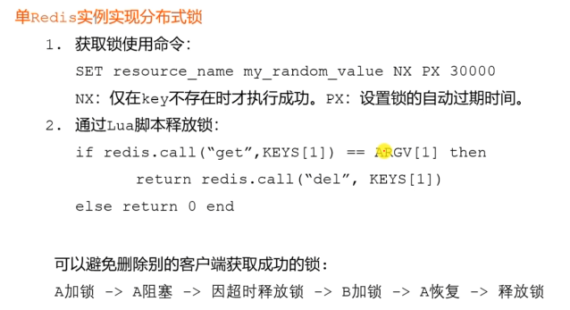
  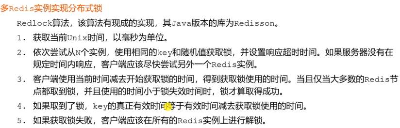
- Spring
  - IOC
  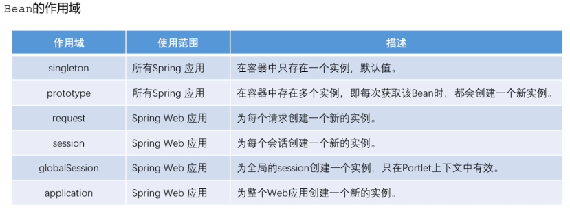
  - AOP
  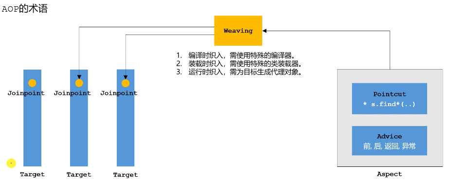
  - MVC
  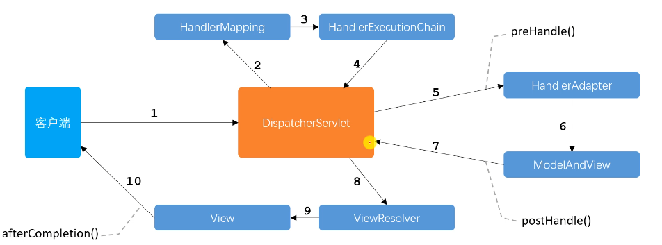